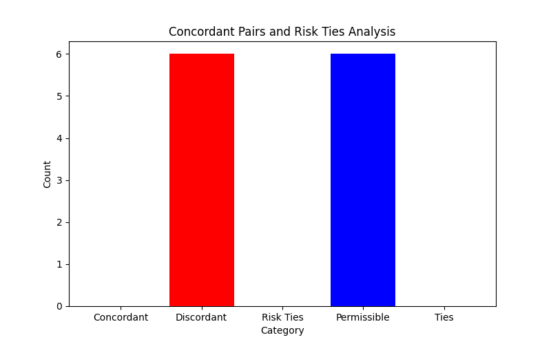

# Concordant Pairs and Risk Ties Analysis

##  Project Overview
This project implements a Python program to analyze **Concordant Pairs**, **Discordant Pairs**, **Risk Ties**, **Ties**, and **Permissible Pairs** from a given dataset.  
This type of analysis is useful in statistical evaluation, especially for evaluating relationships between variables in ranking systems and biomedical data comparison.

The program also provides a visual representation of the analysis results using a **bar chart**.

---

##  Technologies Used
- **Python** – Core programming language used  
- **Matplotlib** – For visualizing the pair analysis (bar chart output)  
- *(Optional: pandas or numpy, if used in your code)*

---

##  Features

- Accepts input data (pairs of scores/ranks)
- Automatically calculates:
  -  Concordant Pairs
  -  Discordant Pairs
  -  Risk Ties
  -  Ties
  -  Permissible Pairs
- Prints the calculated values to the terminal (Command Prompt)
- Generates a **bar chart** summarizing the results

---

## 📊 Sample Input Used in Code

```python
times = [1, 2, 3, 4]
risks = [4, 3, 2, 1]
```

### 📈 Output Example

```
Concordant Pairs: 0
Discordant Pairs: 6
Risk Ties: 0
Permissible Pairs: 6
Ties: 0
```



---

## 📁 Files Included

- `concordant_pairs.py` – Main Python script  
- `output.png` – Bar chart output image  
- `README.md` – Project documentation
```

---
